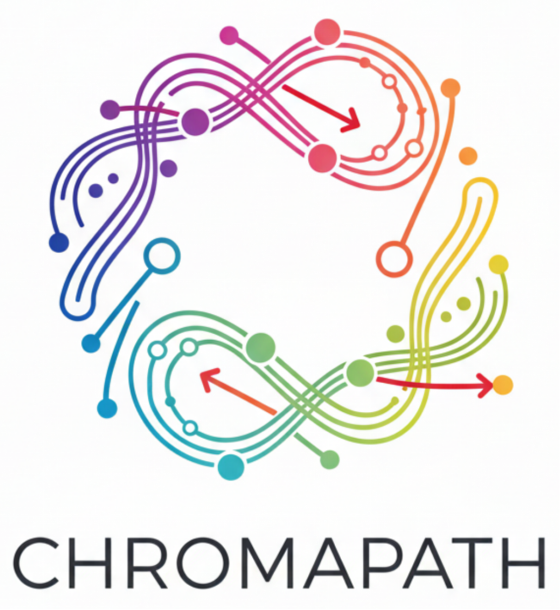

<p align="center">
   
 </p>
 
# Chromapath

[中文](README.md) | **English**

A comprehensive Python toolkit for image color analysis, palette extraction, and visualization.


## Overview

This toolkit contains 5 functional modules that form a complete color analysis pipeline:

| Tool | Function | Input | Output |
|------|----------|-------|--------|
| **Palette Generator** | Generate color cards for each image | Image folder | Color palette images |
| **Color Extractor** | Analyze overall color distribution | Image folder | Color list + percentages |
| **Co-occurrence Analyzer** | Calculate color co-occurrence frequency | Image folder + color list | Frequency matrix |
| **Network Viewer** | Visualize color relationships | Color data + matrix | Network graph |
| **Genetic Optimizer** | Interactive color scheme optimization | Single image | Optimized color scheme |

## Workflow

```
┌─────────────────────────────────────────────────────────────────────────┐
│                        Complete Analysis Pipeline                        │
└─────────────────────────────────────────────────────────────────────────┘

Step 1: Prepare Images
    └── Put images to analyze in a folder

Step 2: Generate Palettes (Palette Generator)
    ├── Input: Image folder
    ├── Settings: Number of colors, gray threshold
    └── Output: Color palette for each image (PNG)

Step 3: Extract Overall Colors (Color Extractor)
    ├── Input: Image folder
    ├── Process: K-Means clustering on all images
    └── Output: Color list + percentages
            e.g., [([255, 128, 64], 0.25), ([32, 64, 128], 0.18), ...]

Step 4: Calculate Co-occurrence (Co-occurrence Analyzer)
    ├── Input: Image folder + color list from Step 3
    ├── Process: Count which colors appear together
    └── Output: N×N co-occurrence frequency matrix

Step 5: Visualize Network (Network Viewer)
    ├── Input: Color data + frequency matrix
    └── Output: Color relationship network graph
            - Nodes = Colors (size = percentage)
            - Edges = Co-occurrence (red = strong correlation)
```

### Standalone: Genetic Algorithm Optimizer

```
┌─────────────────────────────────────────────────────────────────────────┐
│                    Genetic Algorithm Color Optimization                  │
└─────────────────────────────────────────────────────────────────────────┘

1. Open an image
2. System generates multiple color schemes (population)
3. Rate each scheme (0-10)
4. System evolves next generation based on ratings
5. Repeat 3-4 until satisfied
6. Export the best color scheme
```

## Installation

```bash
# Clone the project
https://github.com/CodeSoul-co/Chromapath.git
cd chromapath

# Create virtual environment (recommended)
conda create -n color python=3.10
conda activate color

# Install dependencies
pip install -r requirements.txt
```

## Quick Start

```bash
# Launch main interface
python main.py

# Or launch specific tool directly
python main.py --tool palette      # Palette Generator
python main.py --tool extractor    # Color Extractor
python main.py --tool cooccurrence # Co-occurrence Analyzer
python main.py --tool network      # Network Viewer
python main.py --tool genetic      # Genetic Optimizer
```

## Detailed Usage

### 1. Palette Generator

**Purpose**: Batch generate color palettes for images

**Steps**:
1. Select folder containing images
2. Select output folder for palettes
3. Set parameters:
   - **Gray Threshold**: Filter near-gray pixels (default: 1)
   - **Number of Colors**: Colors to extract per image (default: 8)
4. Click "Generate Palettes"

### 2. Color Extractor

**Purpose**: Analyze overall color distribution across multiple images

**Steps**:
1. Select image folder
2. Set number of colors (default: 18)
3. Click "Analyze Images"
4. View color distribution bar chart
5. Copy color data at bottom (for next step)

**Output Format**:
```
[
    ([R, G, B], percentage),
    ([255, 128, 64], 0.2534),
    ...
]
```

### 3. Co-occurrence Analyzer

**Purpose**: Analyze which colors frequently appear together

**Steps**:
1. Select image folder
2. Paste color data (from Color Extractor)
3. Click "Analyze Co-occurrence"
4. View co-occurrence frequency matrix

**Matrix Interpretation**: 
- `matrix[i][j]` = frequency of color i and j appearing together
- Higher values indicate colors that often appear together

### 4. Network Viewer

**Purpose**: Visualize color relationships as a network graph

**Steps**:
1. Enter color data (format: `R G B Size`)
   ```
   255 128 64 25
   32 64 128 18
   ...
   ```
2. Enter frequency matrix
3. Set thresholds:
   - **Base Threshold**: Minimum weight to show edge
   - **Highlight Threshold**: Weight threshold for red highlight
4. Click "Generate Network"

### 5. Genetic Optimizer

**Purpose**: Find optimal color schemes through interactive evolution

**Steps**:
1. Click "Open Image" to select an image
2. Set parameters:
   - **Colors**: Number of colors in scheme
   - **Grid**: Number of schemes per generation (rows × cols)
   - **Mutation**: Mutation rate
   - **Elite Threshold**: Score threshold for elite retention
3. Rate each scheme using sliders (0-10)
4. Click "Evolve Next Generation"
5. Repeat rating and evolution until satisfied
6. Click "Show Best" to view best scheme

## Use as Library

```python
from color_analyzer.core import ColorExtractor, CooccurrenceAnalyzer
from color_analyzer.visualization import ColorCardGenerator
import numpy as np

# Extract colors
extractor = ColorExtractor(n_colors=8, gray_threshold=1)
colors, percentages = extractor.extract_from_image("image.jpg")

# Generate color card
card_gen = ColorCardGenerator()
card_gen.save_card(colors, percentages, "palette.png")

# Analyze co-occurrence
analyzer = CooccurrenceAnalyzer(distance_threshold=10)
color_list = [np.array(c) for c in colors]
matrix = analyzer.analyze_folder("images/", color_list)
print(analyzer.format_matrix(matrix))
```

## Project Structure

```
chromapath/
├── main.py                 # Main entry point
├── requirements.txt        # Dependencies
├── setup.py               # Package setup
├── pyproject.toml         # Modern Python packaging
├── README.md              # Chinese documentation
├── README_EN.md           # English documentation
├── LICENSE                # MIT License
└── color_analyzer/        # Main package
    ├── __init__.py
    ├── core/              # Core algorithms
    │   ├── image_processor.py   # Image loading & preprocessing
    │   ├── clustering.py        # K-Means color clustering
    │   ├── color_extractor.py   # High-level color extraction
    │   ├── cooccurrence.py      # Co-occurrence analysis
    │   └── genetic.py           # Genetic algorithm
    ├── visualization/     # Visualization tools
    │   ├── color_card.py        # Color palette cards
    │   └── network_plot.py      # Network graphs
    └── ui/                # PyQt5 GUI applications
        ├── main_window.py       # Main launcher
        ├── palette_generator.py
        ├── color_extractor.py
        ├── cooccurrence_analyzer.py
        ├── network_viewer.py
        └── genetic_optimizer.py
```

## Requirements

- Python 3.8+
- NumPy
- OpenCV (opencv-python)
- scikit-learn
- Matplotlib
- PyQt5

## Contributing

Contributions are welcome! Please feel free to submit a Pull Request.

1. Fork the repository
2. Create your feature branch (`git checkout -b feature/AmazingFeature`)
3. Commit your changes (`git commit -m 'Add some AmazingFeature'`)
4. Push to the branch (`git push origin feature/AmazingFeature`)
5. Open a Pull Request

## License

This project is licensed under the MIT License - see the [LICENSE](LICENSE) file for details.
